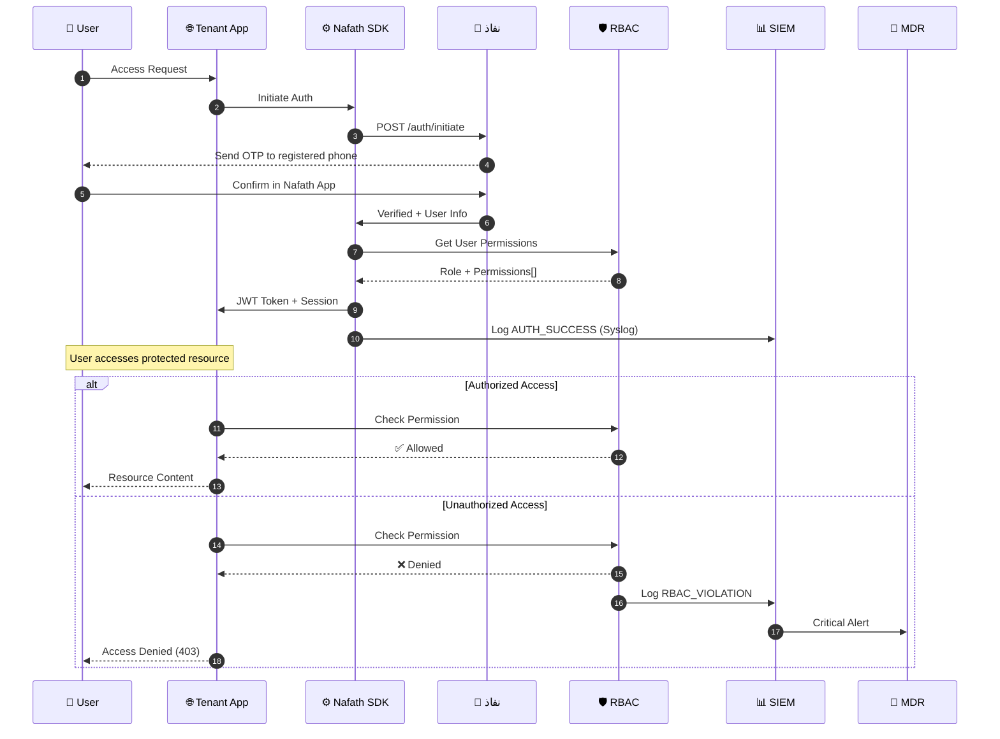
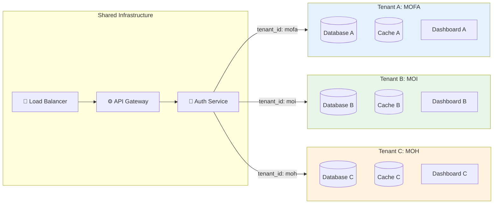
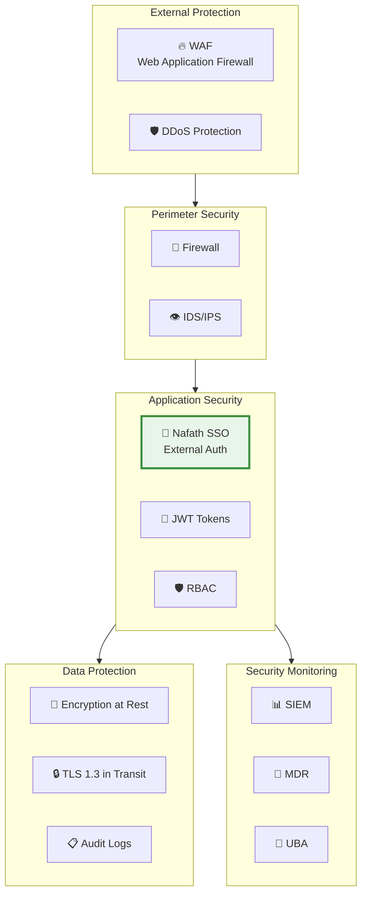
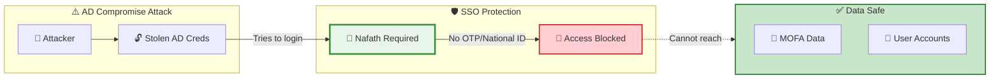

# MOFA SSO Multi-Tenant Architecture
## High-Level Technical Design

```mermaid
flowchart TB
    subgraph TENANTS["🏢 Multi-Tenant Organizations"]
        T1["🏛️ وزارة الخارجية<br/>MOFA"]
        T2["🏛️ وزارة الداخلية<br/>MOI"]
        T3["🏛️ وزارة الصحة<br/>MOH"]
        T4["🏛️ جهات حكومية أخرى<br/>Other Gov"]
    end

    subgraph USERS["👥 User Types per Tenant"]
        U1["👔 Diplomat<br/>دبلوماسي"]
        U2["👨‍💼 Admin Staff<br/>موظف إداري"]
        U3["👨‍💻 Consultant<br/>مستشار"]
    end

    subgraph SSO_LAYER["🔐 SSO Authentication Layer"]
        NAFATH["📱 نفاذ الوطني<br/>Nafath National SSO"]
        NID["🪪 National ID<br/>رقم الهوية"]
        OTP["🔢 OTP Verification<br/>التحقق"]
        BIO["👆 Biometric<br/>البصمة"]
    end

    subgraph SDK_LAYER["⚙️ SDK Integration Layer"]
        SDK["📦 Nafath SDK v2.1<br/>NestJS Backend"]
        AUTH_SVC["🔑 Auth Service"]
        RBAC_SVC["🛡️ RBAC Service"]
        SOC_SVC["📊 SOC Service"]
    end

    subgraph SECURITY_LAYER["🛡️ Security Operations"]
        direction TB
        SIEM["📊 SIEM<br/>Syslog UDP/514"]
        MDR["🔰 SITE.sa MDR<br/>24/7 Monitoring"]
        UBA["🧠 UBA Engine<br/>AI/ML Detection"]
        SOC_DASH["📈 SOC Dashboard"]
    end

    subgraph DATA_LAYER["💾 Data & Cache Layer"]
        DB[(PostgreSQL<br/>User & Audit DB)]
        REDIS[(Redis Cache<br/>Session Store)]
        AD["🗂️ Active Directory<br/>Legacy Auth")]
    end

    subgraph TENANT_DASHBOARDS["📊 Tenant-Specific Dashboards"]
        ADMIN_DASH["👨‍💼 Admin Dashboard<br/>إدارة المستخدمين"]
        USER_DASH["👤 User Dashboard<br/>الخدمات"]
        RBAC_DASH["🔐 RBAC Panel<br/>الصلاحيات"]
        AUDIT_DASH["📋 Audit Trail<br/>سجل التدقيق"]
    end

    %% User Flow
    TENANTS --> USERS
    USERS --> |"Login Request"| NAFATH
    
    %% Nafath Authentication
    NAFATH --> NID
    NID --> OTP
    OTP --> BIO
    BIO --> |"Verified Token"| SDK

    %% SDK Processing
    SDK --> AUTH_SVC
    AUTH_SVC --> |"JWT Token"| RBAC_SVC
    RBAC_SVC --> |"Permissions"| SOC_SVC
    
    %% Security Logging
    SOC_SVC --> |"CEF Events"| SIEM
    SOC_SVC --> |"Critical Alerts"| MDR
    SOC_SVC --> |"Behavior Data"| UBA
    SIEM --> SOC_DASH
    MDR --> SOC_DASH
    UBA --> SOC_DASH

    %% Data Storage
    AUTH_SVC --> DB
    AUTH_SVC --> REDIS
    RBAC_SVC --> DB
    
    %% AD Independence (shown as disconnected for security)
    AD -.->|"Not Required<br/>غير مطلوب"| SDK

    %% Dashboard Access
    SDK --> TENANT_DASHBOARDS
    ADMIN_DASH --> RBAC_DASH
    ADMIN_DASH --> AUDIT_DASH

    %% Styling
    classDef tenant fill:#e3f2fd,stroke:#1976d2,stroke-width:2px
    classDef nafath fill:#e8f5e9,stroke:#388e3c,stroke-width:2px
    classDef security fill:#fff3e0,stroke:#f57c00,stroke-width:2px
    classDef data fill:#f3e5f5,stroke:#7b1fa2,stroke-width:2px
    classDef dashboard fill:#fce4ec,stroke:#c2185b,stroke-width:2px
    
    class T1,T2,T3,T4 tenant
    class NAFATH,NID,OTP,BIO nafath
    class SIEM,MDR,UBA,SOC_DASH security
    class DB,REDIS,AD data
    class ADMIN_DASH,USER_DASH,RBAC_DASH,AUDIT_DASH dashboard
```

---

## 🔄 Authentication Flow



---

## 🏢 Multi-Tenant Data Isolation



---

## 🔗 Integration Endpoints

| Service | Endpoint | Protocol | Purpose |
|---------|----------|----------|---------|
| **Nafath API** | `nafath.api.gov.sa` | HTTPS | Authentication |
| **SIEM** | `siem.mofa.local:514` | Syslog/UDP | Event Logging |
| **MDR** | `mdr.site.sa/api/v1` | HTTPS | Threat Response |
| **SDK Backend** | `api.mofa.gov.sa/v1` | HTTPS | All Operations |
| **Redis** | `redis.mofa.local:6379` | TCP | Session Cache |
| **PostgreSQL** | `db.mofa.local:5432` | TCP | Persistent Data |

---

## 🛡️ Security Layers



---

## 📊 Dashboard Access by Role

| Dashboard | Diplomat | Admin Staff | Consultant | SOC Analyst |
|-----------|:--------:|:-----------:|:----------:|:-----------:|
| User Portal | ✅ | ✅ | ✅ | ❌ |
| RBAC Admin | ❌ | ✅ | ❌ | ❌ |
| Audit Trail | ❌ | ✅ | 👁️ View | ✅ |
| SOC Dashboard | ❌ | ❌ | ❌ | ✅ |
| UBA Analytics | ❌ | ❌ | ❌ | ✅ |
| Tenant Config | ❌ | ✅ | ❌ | ❌ |

---

## 🔑 Key Security Advantage



> **Even if Active Directory is fully compromised, MOFA data remains 100% protected because authentication is handled externally by Nafath - requiring National ID + OTP that attackers cannot obtain.**
